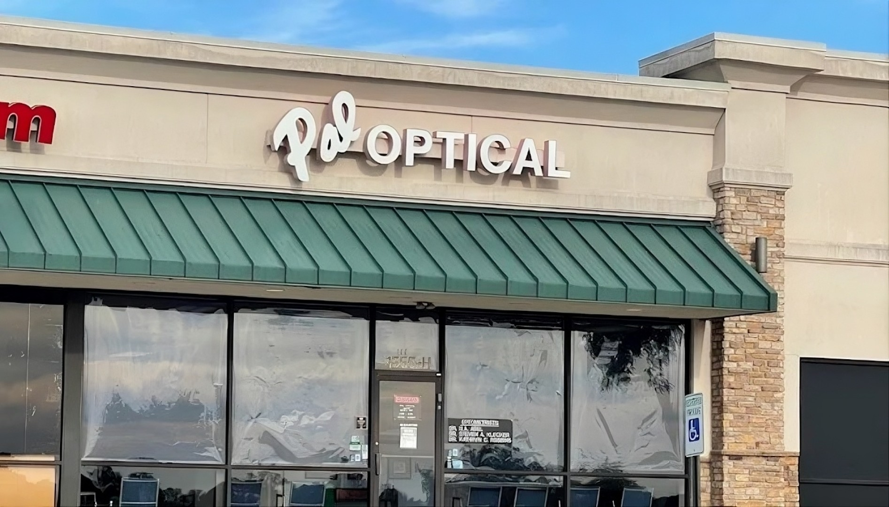

# 👓 Pal Optical - Lexington, KY [](https://github.com/jamesbrentlinger/PALSITE) [](https://github.com/jamesbrentlinger/PALSITE/blob/main/LICENSE)


**Pal Optical** has been Central Kentucky's trusted source for premium eyewear
and expert eyecare since **1955** – over **70 years** of excellence! 🕶️✨

Located at **1555 E New Circle Road Suite 146, Lexington, KY 40509**, we offer:

- 👨‍⚕️ Comprehensive eye exams (Dr. Klecker & Dr. Robbins)
- 🛠️ Full-service optical lab (same-day service available)
- 🏪 Curated designer brands (Ray-Ban, Nike Vision, Michael Kors, & more)
- 💰 Transparent pricing with no hidden fees
- 📧 Contact form & EmailJS integration

## 🌟 Features

| Feature                | Description                                              |
| ---------------------- | -------------------------------------------------------- |
| **Dark/Light Mode**    | Automatic theme toggle with smooth transitions           |
| **Responsive Design**  | Mobile-first, hamburger nav, perfect on all devices 📱💻 |
| **Live Contact Form**  | EmailJS-powered form (no backend needed)                 |
| **Interactive Brands** | Hover effects on designer collections                    |
| **Google Maps**        | Embedded location map                                    |
| **Favicon**            | Custom `favicon.ico` on all pages                        |

## 📱 Live Demo

Open [index.html](index.html) in your browser to see it live!

## 🏗️ Project Structure

```
PALSITE/
├── index.html          # Hero landing page
├── about.html          # Company philosophy & history
├── doctors.html        # Dr. Klecker & Dr. Robbins
├── services.html       # Clinical services overview
├── brands.html         # Ray-Ban, Nike, MK, & more
├── price.html          # Transparent lens/frame pricing
├── policy.html         # Returns, warranty, adjustments
├── contact.html        # Form + map + phone/email
├── style.css           # Dark/light themes, animations
├── script.js           # Mobile menu toggle
├── pallogo.png         # Logo
├── favicon.ico         # Browser tab icon
└── images/             # All assets
```

## 🚀 Quick Start (Static Site - Zero Setup!)

1. Clone/Download repo
2. Double-click `index.html` or drag to browser
3. **Done!** No servers, no installs.

### For Development

```bash
# Open in VS Code Live Server or any static server
npx live-server
# Or just open index.html
start index.html
```

## 🎨 Tech Stack

- **HTML5** | **CSS3** (Custom Properties, Grid, Flexbox, Animations)
- **Vanilla JS** (Mobile nav, EmailJS)
- **Fonts**: Google Fonts (Montserrat, Oswald)
- **CDN**: EmailJS for forms
- **Responsive**: Mobile-first breakpoints

## 📸 Screenshots

**Desktop Hero** (Dark Mode) 

**Brands Grid** 

**Pricing Cards**

> Single Vision: **$50** | Progressives: **$255+** | Frames: **$45+**

## 🤝 Contact

- **Phone**: [859.266.3003](tel:8592663003) (Optical) |
  [859.269.6921](tel:8592696921) (Exams)
- **Email**: [paloptical18@gmail.com](mailto:paloptical18@gmail.com)
- **Hours**: Mon-Sat 9AM-6PM (Closed Sundays)

## 📄 License

MIT © [James Brentlinger](https://github.com/jamesbrentlinger) 2026

---

⭐ **Star this repo if you love it!** Built with ❤️ for Pal Optical.
